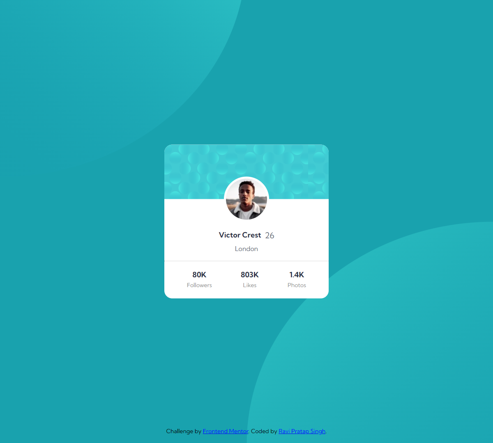

# Profile-card-component

# Frontend Mentor - Profile card component solution

This is a solution to the [Profile card component challenge on Frontend Mentor](https://www.frontendmentor.io/challenges/profile-card-component-cfArpWshJ). Frontend Mentor challenges help you improve your coding skills by building realistic projects. 

## Table of contents

- [Overview](#overview)
  - [The challenge](#the-challenge)
  - [Screenshot](#screenshot)
  - [Links](#links)

  - [Built with](#built-with)
  - [Continued development](#continued-development)
- [Author](#author)
- [Acknowledgments](#acknowledgments)

## Overview
Profile card Component 

### The challenge

- Develop the profile-card-component designs of which are provided by the fronend mentor.

### Screenshot

-Windows

-mobile

### Links

- Solution URL: 
- Live Site URL: 

### Built with

- Semantic HTML5 markup
- CSS custom properties
- Flexbox

- Mobile-first workflow

### Continued development
 I would be more focussing on learning the React and the Advanced JavaScript

## Author

- Frontend Mentor - [@cyberspatial](https://www.frontendmentor.io/profile/cyberspatial)

## Acknowledgments

Special thanks to the frontend mentor platform for providing the designs to be developed to complete the challenge.
